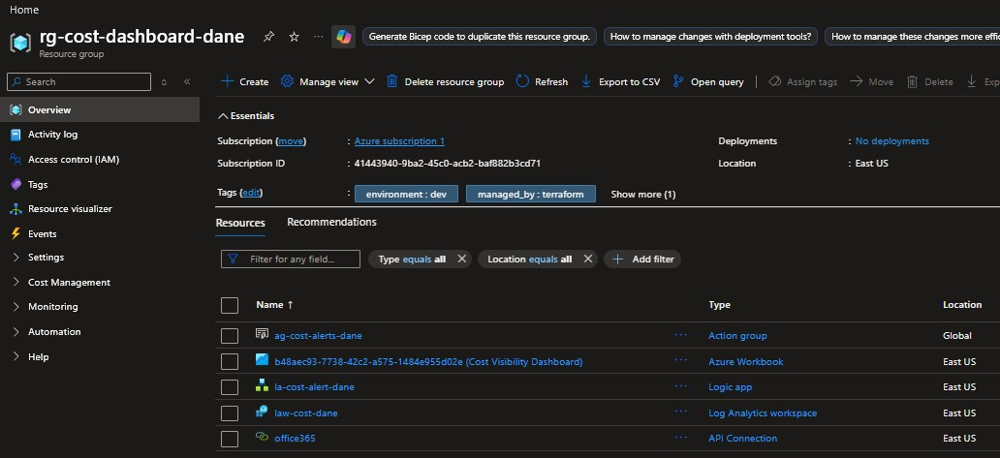
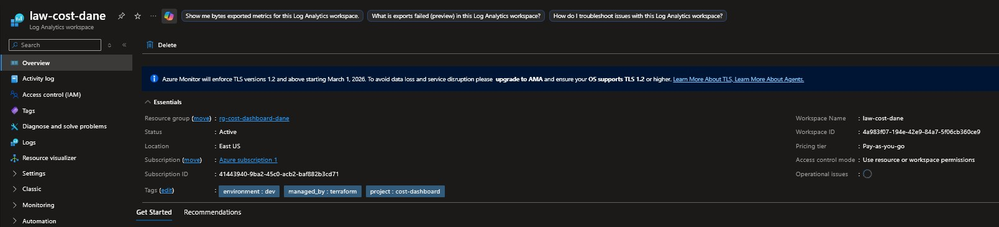
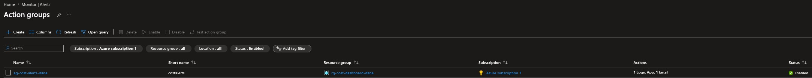
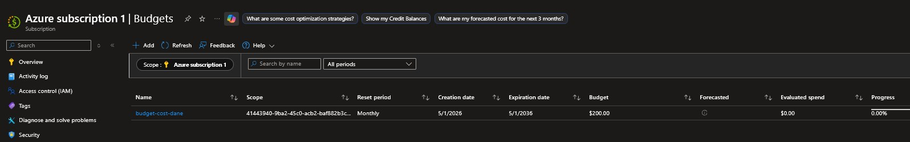
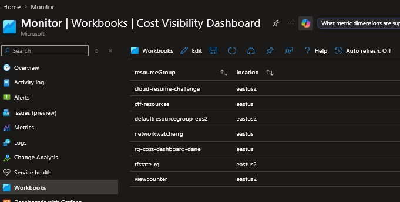
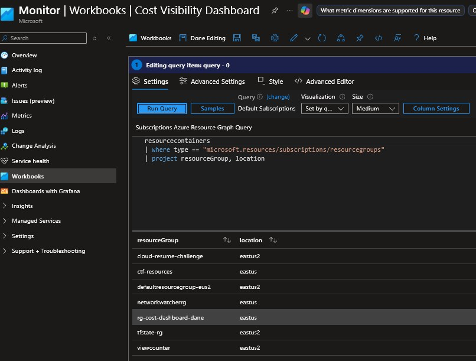
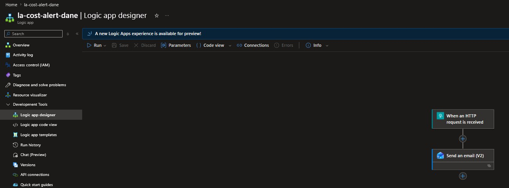
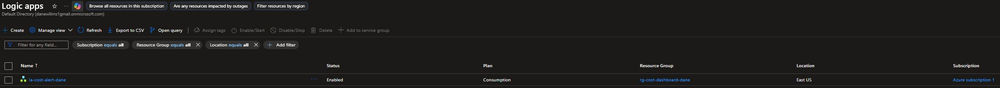

# Azure Cost Visibility Dashboard

**[▶ Watch me build this on Loom](https://www.loom.com/share/)**

---

**Author:** Dane Willms [LinkedIn](https://www.linkedin.com/in/dane-willms-3612a9281/) · [GitHub](https://github.com/Dane139)

---

## Overview
 
Most small businesses move to the cloud because someone told them it would be cheaper than managing their own servers. Then the bills start arriving — full of line items like `Microsoft.Compute/virtualMachines — $340` that nobody in the business can interpret, predict, or explain to anyone else.
 
This project fixes that. You are building a system that:
 
- Tracks spending across all Azure services and translates it into categories a business owner can read
- Fires automatic alerts when spending hits thresholds ($50, $100, $200)
- Sends email notifications via Logic Apps when an alert triggers
- Displays a dashboard in Azure Workbooks showing spend by service, resource group, and week
- Generates a weekly comparison report showing what changed and where costs are trending


**The problem it solves:** Business owners and engineers flying blind on cloud spend until the invoice lands.

**What it replaces:** Manual cost reviews, surprise bills, and "who spun that up?" conversations.

---

## Badges


---

## What It Does

- Monitors your Azure subscription against a configurable monthly budget
- Fires email alerts at **25% ($50)**, **50% ($100)**, and **100% ($200)** thresholds before you are already over
- Routes alerts through a Logic App that formats and delivers the notification to any inbox
- Ships subscription activity logs (administrative, security, policy) into a central Log Analytics workspace
- Surfaces spend and resource data through an Azure Workbooks dashboard built on Resource Graph queries

---

## Architecture

### Diagram

See [assets/architecture.jpg](assets/architecture.jpg) for the full rendered diagram.

```
                   rg-cost-dashboard-[yourname]
  ┌──────────────────────────────────────────────────────────────────┐
  │                                                                  │
  │  Azure Subscription Spend                                        │
  │         │                                                        │
  │         ▼                                                        │
  │  ┌─────────────────────┐   fires   ┌──────────────────────┐     │
  │  │  Consumption Budget │──────────▶│    Action Group      │     │
  │  │  $50 / $100 / $200  │           │  ag-cost-alerts-*    │     │
  │  └─────────────────────┘           └──────┬───────┬───────┘     │
  │                                           │       │             │
  │                              calls webhook│       │direct email │
  │                                           ▼       ▼             │
  │                               ┌──────────────┐  ┌───────────┐  │
  │                               │  Logic App   │  │   Inbox   │  │
  │                               │ HTTP→ email  │─▶│  (Gmail / │  │
  │                               └──────────────┘  │ O365)     │  │
  │                                                  └───────────┘  │
  │  ─ ─ ─ ─ ─ ─ ─ ─ ─ observability layer ─ ─ ─ ─ ─ ─ ─ ─ ─ ─   │
  │                                                                  │
  │  Subscription Logs   ┌────────────────┐   ┌──────────────────┐  │
  │  (Admin/Sec/Policy)─▶│  Diag Setting  │──▶│  Log Analytics   │  │
  │                      └────────────────┘   │   Workspace      │  │
  │                                           └────────┬─────────┘  │
  │                                                    │read        │
  │                                           ┌────────▼─────────┐  │
  │                                           │  Azure Workbooks │  │
  │                                           │  Cost Dashboard  │  │
  │                                           └──────────────────┘  │
  └──────────────────────────────────────────────────────────────────┘
```

### Alert Flow

| Step | Service | What It Does |
|------|---------|--------------|
| 1 | Cost Management Budget | Monitors monthly subscription spend against a $200 limit |
| 2 | Monitor Action Group | Receives the alert and fans out to two channels |
| 3a | Email (direct) | Sends a raw notification to your inbox immediately |
| 3b | Logic App Workflow | Formats the alert payload and sends a structured email |
| 4 | Gmail / Office 365 Inbox | Receives the formatted cost alert |

### Logging and Visibility Flow

| Step | Service | What It Does |
|------|---------|--------------|
| 1 | Diagnostic Setting | Pipes subscription activity logs into Log Analytics |
| 2 | Log Analytics Workspace | Stores and indexes administrative, security, and policy logs |
| 3 | Azure Workbooks | Queries Log Analytics and Resource Graph to render the dashboard |

---


## Resources Deployed

| Resource | Name |
|----------|------|
| Resource Group | `rg-cost-dashboard-[yourname]` |
| Cost Management Budget | `budget-cost-[yourname]` |
| Monitor Action Group | `ag-cost-alerts-[yourname]` |
| Logic App Workflow | `la-cost-alert-[yourname]` |
| Log Analytics Workspace | `law-cost-[yourname]` |
| Diagnostic Setting | `diag-sub-to-law` |
| Azure Workbook | `Cost Visibility Dashboard` |

After `terraform apply`, the resource group confirms all resources are live:



---

## Stack

| Layer | Service |
|-------|---------|
| IaC | Terraform (`azurerm ~> 3.0`) |
| Cost monitoring | Azure Cost Management Budgets |
| Alerting | Azure Monitor Action Groups |
| Automation | Azure Logic Apps |
| Logging | Azure Log Analytics Workspace |
| Visualization | Azure Workbooks + Resource Graph |

---

## Prerequisites
 
Complete these before starting. If you have already done the data lab, Terraform and the Azure CLI are already installed — skip to Step 4.
 
### Mac
 
```bash
# 1. Install Homebrew
/bin/bash -c "$(curl -fsSL https://raw.githubusercontent.com/Homebrew/install/HEAD/install.sh)"
 
# 2. Install Terraform
brew tap hashicorp/tap
brew install hashicorp/tap/terraform
terraform --version
 
# 3. Install Azure CLI
brew install azure-cli
az --version
 
# 4. Log in to Azure
az login
az account set --subscription "Azure subscription 1"
az account show
```
 
### Windows (PowerShell)
 
```powershell
# 1. Install Terraform
# Download from https://developer.hashicorp.com/terraform/install
# Extract to C:\terraform\ then add to PATH:
[Environment]::SetEnvironmentVariable("PATH", $env:PATH + ";C:\terraform", "User")
terraform --version
 
# 2. Install Azure CLI
# Download from https://aka.ms/installazurecliwindows then verify:
az --version
 
# 3. Log in to Azure
az login
az account set --subscription "Azure subscription 1"
az account show
```
 
---
 
## Folder Setup
 
**Mac:**
```bash
mkdir ~/cost-dashboard-001
cd ~/cost-dashboard-001
touch main.tf variables.tf outputs.tf terraform.tfvars
```
 
**Windows (PowerShell):**
```powershell
New-Item -ItemType Directory -Path "$HOME\cost-dashboard-001"
cd "$HOME\cost-dashboard-001"
New-Item -ItemType File main.tf, variables.tf, outputs.tf, terraform.tfvars
```
 
---

## Setup

### 1. Clone the repo

```bash
git clone https://github.com/dane139/azure-cost-dashboard.git
cd azure-cost-dashboard
```

### 2. Fill in your variables

Edit `terraform.tfvars`:

```hcl
yourname    = "yourname"       # lowercase, no spaces — used in resource naming
location    = "East US"
alert_email = "you@email.com"
```

### 3. Set the budget start date

In `main.tf`, update `start_date` to the first of the current or upcoming month:

```hcl
start_date = "2026-05-01T00:00:00Z"
```

> Azure requires this to be the first of a current or future month. If it's in the past, `terraform apply` will fail with `BudgetStartDateInvalid`.

### 4. Deploy

```bash
terraform init
terraform plan    # verify 6 resources before applying
terraform apply
```

Deploys in under five minutes. Runs for free at lab scale.

---

## Terraform Configuration

## Step 1 — Write `variables.tf`
 
```hcl
variable "yourname" {
  description = "Your name, lowercase, no spaces. Used to make resource names unique."
  type        = string
}
 
variable "location" {
  description = "Azure region to deploy into."
  type        = string
  default     = "East US"
}
 
variable "alert_email" {
  description = "Email address to receive cost alert notifications."
  type        = string
}
 
variable "tags" {
  type = map(string)
  default = {
    project     = "cost-dashboard"
    environment = "dev"
    managed_by  = "terraform"
  }
}
```

---
 
## Step 2 — Write `terraform.tfvars`
 
```hcl
yourname    = "yourname"
location    = "East US"
alert_email = "your.email@example.com"
```
 
Replace `your.email@example.com` with the email address where you want to receive cost alerts.
 
---
 
## Step 3 — Write `main.tf`
 
Each resource block is explained before the code so you understand what it does and why it is written the way it is.
 
### Provider and data sources
 
The `azurerm` provider is the Terraform plugin that knows how to talk to Azure. `features {}` is required but can be left empty for most configurations. The `azurerm_client_config` data source reads your current `az login` session and gives Terraform your subscription ID and tenant ID, which are needed for budget and alert scope configuration.
 
```hcl
terraform {
  required_providers {
    azurerm = {
      source  = "hashicorp/azurerm"
      version = "~> 3.0"
    }
  }
}
 
provider "azurerm" {
  features {}
}
 
data "azurerm_client_config" "current" {}
```
 
### Resource group
 
Every Azure resource must live inside a resource group. Think of it as a folder — it holds all the resources for this project together, controls who has access, and makes cleanup easy (deleting the resource group deletes everything inside it).
 
```hcl
resource "azurerm_resource_group" "main" {
  name     = "rg-cost-dashboard-${var.yourname}"
  location = var.location
  tags     = var.tags
}
```
 
### Log Analytics Workspace
 
Log Analytics is Azure's central logging and querying service. It stores activity logs, diagnostic data, and metrics from across your Azure resources in one place. `sku = "PerGB2018"` means you pay only for data ingested — there is no flat monthly fee, and at lab scale the cost is negligible.
 
`retention_in_days = 30` is the minimum allowed value and keeps costs low for a lab environment.
 
```hcl
resource "azurerm_log_analytics_workspace" "main" {
  name                = "law-cost-${var.yourname}"
  location            = var.location
  resource_group_name = azurerm_resource_group.main.name
  sku                 = "PerGB2018"
  retention_in_days   = 30
  tags                = var.tags
}
```
 

 
### Action Group
 
An Action Group is Azure Monitor's way of defining what should happen when an alert fires. It is a reusable list of notification targets — email addresses, SMS numbers, Logic App webhooks, and more. You define it once and attach it to as many alert rules as you like.
 
`short_name` is required and must be 12 characters or less. It appears in SMS notifications.
 
`use_common_alert_schema = true` means the email body uses a standardized format that works consistently across all alert types — this is the recommended setting.
 
```hcl
resource "azurerm_monitor_action_group" "email_alerts" {
  name                = "ag-cost-alerts-${var.yourname}"
  resource_group_name = azurerm_resource_group.main.name
  short_name          = "costalerts"
 
  email_receiver {
    name                    = "owner-email"
    email_address           = var.alert_email
    use_common_alert_schema = true
  }
 
  tags = var.tags
}
```
 

 
### Budget with alert thresholds
 
`azurerm_consumption_budget_subscription` creates an Azure Cost Management budget at the subscription level. This is what watches your overall Azure spending and fires alerts when you cross thresholds.
 
`time_grain = "Monthly"` resets the budget tracking at the start of each calendar month.
 
The `start_date` must be the first day of the current or a future month in RFC3339 format. Update the year and month to match when you are running this lab.
 
`amount = 200` sets the total monthly budget at $200. Alert thresholds fire at 25% ($50), 50% ($100), and 100% ($200).
 
```hcl
resource "azurerm_consumption_budget_subscription" "main" {
  name            = "budget-cost-${var.yourname}"
  subscription_id = data.azurerm_client_config.current.subscription_id
 
  amount     = 200
  time_grain = "Monthly"
 
  time_period {
    start_date = "2026-05-01T00:00:00Z"
  }
 
  notification {
    enabled        = true
    threshold      = 25
    operator       = "GreaterThan"
    threshold_type = "Actual"
    contact_groups = [azurerm_monitor_action_group.email_alerts.id]
  }
 
  notification {
    enabled        = true
    threshold      = 50
    operator       = "GreaterThan"
    threshold_type = "Actual"
    contact_groups = [azurerm_monitor_action_group.email_alerts.id]
  }
 
  notification {
    enabled        = true
    threshold      = 100
    operator       = "GreaterThan"
    threshold_type = "Actual"
    contact_groups = [azurerm_monitor_action_group.email_alerts.id]
  }
}
```
 

 
### Logic App Workflow
 
A Logic App is Azure's low-code automation service. It connects different systems together through triggers and actions. In this project, the Logic App receives a webhook call from Azure Monitor when a budget alert fires, formats the alert data into a readable message, and sends a notification email.
 
`logic_app_workflow` creates the Logic App container. The workflow definition is managed separately in the portal after deployment — Terraform provisions the resource, and you configure the steps in the visual designer.
 
```hcl
resource "azurerm_logic_app_workflow" "cost_alert" {
  name                = "la-cost-alert-${var.yourname}"
  location            = var.location
  resource_group_name = azurerm_resource_group.main.name
  tags                = var.tags
}
```
 

 
### Diagnostic settings
 
This resource tells Azure to forward the subscription's activity log into your Log Analytics workspace. The activity log records every management operation on your subscription: who created or deleted what, when, and from where. Without this, Log Analytics has no data to query.
 
```hcl
resource "azurerm_monitor_diagnostic_setting" "subscription_logs" {
  name                       = "diag-sub-to-law"
  target_resource_id         = "/subscriptions/${data.azurerm_client_config.current.subscription_id}"
  log_analytics_workspace_id = azurerm_log_analytics_workspace.main.id
 
  enabled_log {
    category = "Administrative"
  }
 
  enabled_log {
    category = "Security"
  }
 
  enabled_log {
    category = "Policy"
  }
}
```
 
---
 
## Step 4 — Write `outputs.tf`
 
Outputs print useful values to your terminal after `terraform apply` completes. They save you from hunting through the portal for information you need for the next steps.
 
```hcl
output "resource_group_name" {
  value = azurerm_resource_group.main.name
}
 
output "log_analytics_workspace_id" {
  value = azurerm_log_analytics_workspace.main.id
}
 
output "logic_app_callback_url" {
  description = "Use this URL when configuring the Logic App HTTP trigger in the portal."
  value       = azurerm_logic_app_workflow.cost_alert.access_endpoint
}
 
output "action_group_id" {
  value = azurerm_monitor_action_group.email_alerts.id
}
```
 
---
 
## Step 5 — Deploy
 
Mac and Windows (PowerShell) — these commands are identical on both platforms:
 
```bash
terraform init
```
 
You should see: `Terraform has been successfully initialized.`
 
```bash
terraform plan
```
 
Review the plan. You should see 6 resources to add: resource group, log analytics workspace, action group, consumption budget, logic app workflow, and diagnostic setting.
 
```bash
terraform apply
```
 
Type `yes` when prompted. Deployment takes approximately 2–3 minutes.
 
---
 
## Step 6 — Configure the Logic App Workflow in the Portal
 
Terraform created the Logic App container. Now you will add the trigger and action steps using the visual designer.
 
1. In the Azure portal, navigate to your resource group `rg-cost-dashboard-[yourname]`
2. Click on `la-cost-alert-[yourname]`
3. In the left menu, click **Logic app designer**
4. Click **Add a trigger** → search for `HTTP` → select **When a HTTP request is received**
5. Copy the **HTTP POST URL** that appears — this is the webhook URL Azure Monitor will call when a budget alert fires
6. Click **+ New step** → search for `Office 365 Outlook` → select **Send an email (V2)**
7. Sign in with your Microsoft account when prompted
8. Fill in the email fields:
   - **To:** your alert email address
   - **Subject:** `Azure Cost Alert — Budget Threshold Reached`
   - **Body:** click **Add dynamic content** and add the `Body` field from the HTTP trigger
9. Click **Save**


 
### Connect the Logic App to the Action Group
 
After saving, add the Logic App as a receiver in the Action Group.
 
**Mac:**
```bash
az monitor action-group update \
  --name ag-cost-alerts-[yourname] \
  --resource-group rg-cost-dashboard-[yourname] \
  --add-action logicapp la-webhook la-cost-alert-[yourname] \
    /subscriptions/<sub-id>/resourceGroups/rg-cost-dashboard-[yourname]/providers/Microsoft.Logic/workflows/la-cost-alert-[yourname] \
    <logic-app-callback-url>
```
 
**Windows (PowerShell):**
```powershell
az monitor action-group update `
  --name ag-cost-alerts-[yourname] `
  --resource-group rg-cost-dashboard-[yourname] `
  --add-action logicapp la-webhook la-cost-alert-[yourname] `
    /subscriptions/<sub-id>/resourceGroups/rg-cost-dashboard-[yourname]/providers/Microsoft.Logic/workflows/la-cost-alert-[yourname] `
    <logic-app-callback-url>
```
 
Replace `<sub-id>` with your subscription ID (`az account show --query id -o tsv`) and `<logic-app-callback-url>` with the URL you copied from the designer.
 
---
 
## Step 7 — Build the Cost Dashboard in Azure Workbooks
 
Azure Workbooks is a reporting tool built into the Azure portal. You will build a dashboard that shows spending by service and by resource group.
 
1. In the portal, search for **Monitor** → click **Workbooks** in the left menu
2. Click **+ New**
3. Click **+ Add** → **Add query**
4. Set the **Data source** to `Azure Resource Graph`
5. Paste the following query:
```kusto
resourcecontainers
| where type == "microsoft.resources/subscriptions/resourcegroups"
| project resourceGroup, location
```
 
6. Click **Run Query** to verify it works, then click **Done Editing**
7. Click **+ Add** → **Add metric** → select your subscription → choose **Cost Management** as the resource type
8. Click **Save** → give the workbook a name like `Cost Visibility Dashboard` → select your resource group → click **Apply**
Your workbook is now saved and accessible from the Workbooks section of Azure Monitor any time you open the portal.
 

 

 
---
 
## Verification Checklist
 
- [ ] Resource group `rg-cost-dashboard-[yourname]` exists in the portal
- [ ] Budget `budget-cost-[yourname]` appears in **Cost Management → Budgets**
- [ ] Action group `ag-cost-alerts-[yourname]` exists in **Monitor → Action groups**
- [ ] Logic App `la-cost-alert-[yourname]` exists and shows a green **Enabled** status
- [ ] Logic App designer shows an **HTTP trigger** and a **Send email** action
- [ ] Log Analytics workspace `law-cost-[yourname]` exists
- [ ] Azure Workbook is saved and visible in **Monitor → Workbooks**


 
---
 
## Troubleshooting
 
| Error | Cause | Resolution |
|-------|-------|------------|
| `BudgetStartDateInvalid` | Start date must be the first of a current or future month | Update `start_date` in `main.tf` to the first of the current month |
| `AuthorizationFailed` on budget | Your account may need Cost Management Contributor role | `az role assignment create --role "Cost Management Contributor" --assignee <your-email> --scope /subscriptions/<sub-id>` |
| Logic App email step asks for sign-in | Office 365 connection requires interactive auth | Sign in through the portal designer — this cannot be automated by Terraform |
| Alert email not received | Budget thresholds require actual spend to cross the limit | Use the portal to manually trigger a test action from the Action Group to verify email delivery |
 
---
 
## Teardown
 
```bash
terraform destroy
```
 
Type `yes` when prompted. This deletes all resources in the project including the resource group, budget, Logic App, and Log Analytics workspace.
 
The Workbook was created manually in the portal — delete it there separately under **Monitor → Workbooks**.
 
---

## Assets
 
```
assets/
├── resource-group-overview.jpg     ← renamed from Azure_cost_vis_pic1.jpg
├── budget-blade.jpg                ← renamed from azure_vis_pic2.jpg
├── action-group.jpg                ← renamed from azure_cost_vis_pic3.jpg
├── workbooks-dashboard.jpg         ← renamed from cost_vis_pic_4.jpg
├── workbooks-query-editor.jpg      ← renamed from cost_vis_pic_5.jpg
├── log-analytics-workspace.jpg     ← renamed from cost_vis_pic6.jpg
├── logic-app-designer.jpg          ← renamed from cost_vis_pic_7.jpg
└── logic-app-list.jpg              ← renamed from cost_vis_pic8.jpg
```
 
---

## Resources

- [Azure Cost Management documentation](https://learn.microsoft.com/en-us/azure/cost-management-billing/)
- [Azure Monitor Action Groups](https://learn.microsoft.com/en-us/azure/azure-monitor/alerts/action-groups)
- [Azure Logic Apps overview](https://learn.microsoft.com/en-us/azure/logic-apps/logic-apps-overview)
- [Azure Workbooks](https://learn.microsoft.com/en-us/azure/azure-monitor/visualize/workbooks-overview)
- [Terraform azurerm provider](https://registry.terraform.io/providers/hashicorp/azurerm/latest/docs)

---

*Part of a hands-on Azure cloud engineering lab series.*